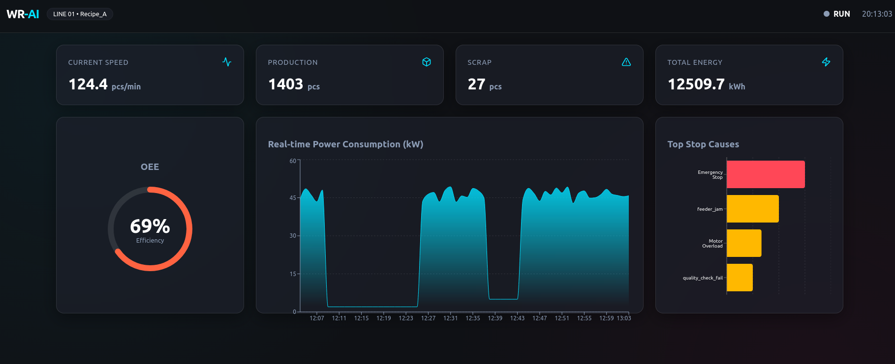

# WR-AI: Industrial AI Integration POC



**WR-AI** is an intelligent "smart layer" designed to monitor, diagnose, and optimize industrial machines. This project serves as a Proof of Concept (POC) demonstrating the core capabilities of data acquisition, OEE monitoring, and AI-based anomaly detection.

## 🚀 Project Overview

The system transforms raw machine data (simulated for this POC) into actionable operational decisions.

### ✅ Module 1: Foundation & OEE
- **Real-time Monitoring**: Visualization of machine state, speed, and production data.
- **OEE Calculation**: Instant efficiency metrics (Availability, Performance, Quality).
- **Energy Analytics**: Live power consumption monitoring (kW).
- **Pareto Analysis**: Identification of top downtime causes.

### ✅ Module 2: Anomaly Detection (AI)
- **Unsupervised Learning**: Uses `IsolationForest` (Scikit-learn) to learn normal operating conditions.
- **Real-time Scoring**: Live "Risk Score" (0-100%) based on multi-sensor fusion (Vibration, Temperature, Power).
- **Automated Alerts**: Early warning system for process drifts.
- **Calibrating Phase**: Auto-calibration on startup (first 60s).

## 🛠 Tech Stack

- **Backend**: Python (FastAPI)
  - Modular Architecture (`modules/foundation`, `modules/anomaly_detection`)
  - ML Library: Scikit-learn
  - Simulation: Custom PLC & Serial Port Simulator
- **Frontend**: React (Vite)
  - Recharts for data visualization
  - Framer Motion for animations
  - Lucide-React for UI icons

## 📦 Installation & Setup

### Prerequisites
- Python 3.8+
- Node.js 16+

### Quick Start (Linux/Mac)
The easiest way to run the project is using the automated launcher:

```bash
chmod +x start.sh
./start.sh
```

This script will automatically:
1. Create/Update the Python virtual environment.
2. Install Python dependencies (`requirements.txt`).
3. Install Node.js dependencies (`package.json`).
4. Launch both Backend and Frontend.

The dashboard will be available at `http://localhost:5173`.
The API will be available at `http://localhost:8000`.

## 🔮 Future Roadmap

See [ROADMAP.md](./ROADMAP.md) for the detailed list of future AI modules (Diagnosi Guidata, Predictive Maintenance, Computer Vision, etc.).
